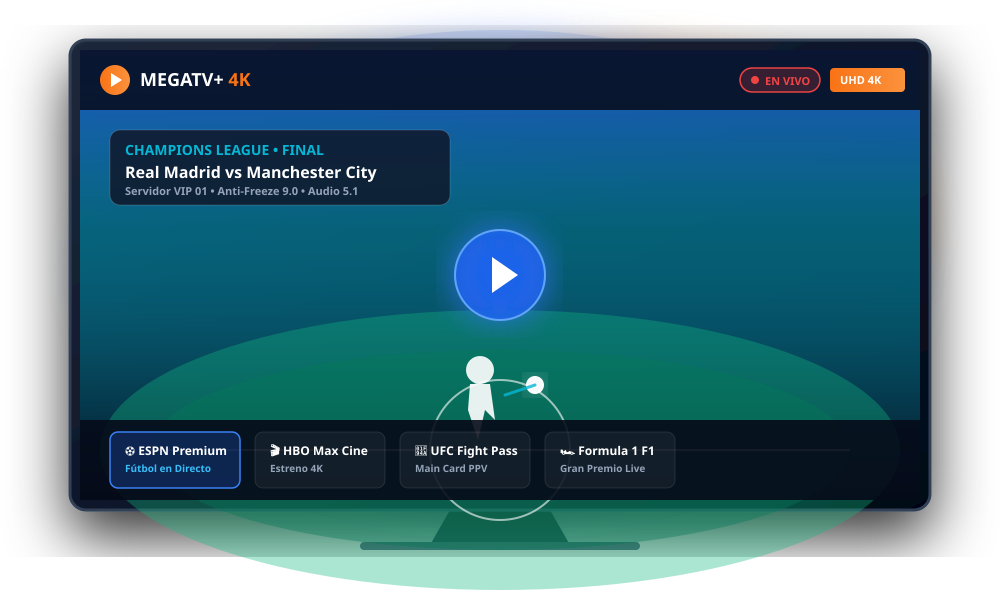
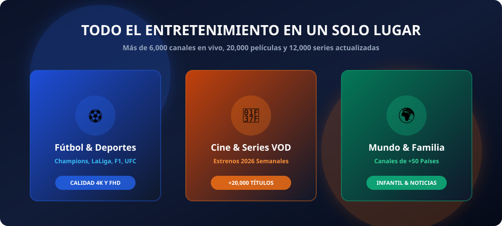

# 🎬 MEGATV+ | Plataforma de Streaming & Conversational AI Landing Page

<div align="center">
  

  <br />

  <!-- Badges de Tecnologías y Habilidades -->
  [](https://developer.mozilla.org/es/docs/Web/HTML)
  [](https://developer.mozilla.org/es/docs/Web/CSS)
  [](https://developer.mozilla.org/es/docs/Web/JavaScript)
  [](#)
  [](#)
  [](#)

  <p align="center">
    <strong>Plataforma web de alta conversión para servicios de streaming digital con agente de Inteligencia Artificial integrado para atención al cliente y lead routing en tiempo real.</strong>
  </p>
</div>

---

## 📌 Descripción del Proyecto

**MEGATV+** es una solución web orientada a la venta y soporte de servicios de entretenimiento y televisión por internet en alta definición (4K / FHD). El proyecto combina una interfaz de usuario (*UI/UX*) moderna y altamente persuasiva con un **motor conversacional de Inteligencia Artificial (MegaBot IA)** que califica prospectos, resuelve dudas técnicas de compatibilidad y enruta clientes calificados directamente a canales de mensajería para el cierre de ventas.

Desarrollado bajo una arquitectura **Vanilla (Zero-Dependencies)**, el sitio web ofrece tiempos de carga ultrarrápidos, alta accesibilidad, marcado de datos estructurados para Google Search (SEO) y una experiencia 100% responsiva optimizada para dispositivos móviles, tablets y pantallas de escritorio.

---

## 🚀 Capturas y Recursos Visuales

<div align="center">
  
  <p><em>Ecosistema multi-plataforma: Smart TVs, Firestick, Android TV, Smartphones y PC</em></p>

  
  <p><em>Vitrina modular de contenidos deportivos en vivo y catálogo de cine/series</em></p>
</div>

---

## 🛠️ Tecnologías y Conceptos de Ingeniería Aplicados

### 1. Frontend & UI/UX
* **HTML5 Semántico**: Estructuración accesible utilizando etiquetas semánticas (`<header>`, `<nav>`, `<section>`, `<article>`, `<footer>`) para optimizar la indexación web.
* **CSS3 Moderno & Variables CSS**:
  * Implementación de *Custom Properties* (`:root`) para gestión centralizada de temas de color (*Dark Navy, Electric Blue y High-Conversion Orange*).
  * Acabados modernos con **Glassmorphism**, resplandores dinámicos (*glow effects*) y micro-interacciones.
  * Tipografía fluida y escalable mediante funciones matemáticas nativas como `clamp()`, `min()` y `max()`.
* **Mobile-First & Anti-Overflow Architecture**:
  * Diseño 100% responsivo probado en múltiples densidades de píxeles y pantallas móviles (desde 360px hasta 4K).
  * Control estricto del viewport evitando desbordamientos horizontales en carruseles y pestañas mediante *scroll-snap* y *touch-swipe* nativo.

### 2. Lógica de Programación & JavaScript ES6+
* **Separación de Responsabilidades (SoC - Separation of Concerns)**:
  * `config.js`: Objeto de configuración global desacoplado de la vista, permitiendo parametrizar números de contacto, planes y reglas de negocio sin tocar el código fuente.
  * `chatbot.js`: Motor conversacional autónomo y gestor de eventos del asistente virtual.
  * `main.js`: Lógica de interacción en la interfaz (selector dinámico de planes, acordeón de FAQs, renderizado dinámico de dispositivos).
* **Motor de Inteligencia Artificial (NLP & Intent Classification)**:
  * Algoritmo de clasificación de intenciones en lenguaje natural para detectar intenciones de compra, solicitud de demos gratuitas, dudas de compatibilidad (*Smart TV, Fire Stick, TV Box*) y medios de pago.
  * Generación dinámica de tarjetas CTA con codificación segura de URLs (`encodeURIComponent`) para preservación del contexto del usuario.
  * Arquitectura lista para integración híbrida con APIs de LLM en tiempo real (**Google Gemini API / OpenAI API**).
* **Gestión Dinámica del Estado & Renderizado**:
  * Cálculo dinámico de descuentos, períodos promocionales y bonificaciones de meses gratis directamente en el cliente.
  * Formateo de monedas internacionalizado utilizando la API nativa `Intl.NumberFormat`.

### 3. SEO Técnico & Datos Estructurados
* **Open Graph & Twitter Cards**: Metadatos enriquecidos para previsualizaciones optimizadas en redes sociales y aplicaciones de mensajería (WhatsApp, Telegram, Facebook).
* **Schema.org JSON-LD**: Integración de esquemas estructurados de `Product`, `AggregateRating` y `FAQPage` para facilitar la aparición de *Rich Snippets* (fragmentos enriquecidos) en los resultados de búsqueda de Google.

---

## 📂 Estructura del Código

```bash
megatv-plus-landing/
├── index.html              # Estructura principal, meta SEO y Schema JSON-LD
├── .gitignore              # Exclusiones de Git (archivos temporales y del sistema)
├── README.md               # Documentación técnica del proyecto
├── css/
│   └── styles.css          # Sistema de diseño, layout flex/grid y media queries
├── js/
│   ├── config.js           # Configuración de variables de entorno y datos de marca
│   ├── chatbot.js          # Agente conversacional de IA y Lead Routing
│   └── main.js             # Controlador de eventos del DOM y componentes UI
└── assets/                 # Recursos visuales y gráficos vectoriales optimizados
    ├── hero-tv-mockup.svg  # Mockup 4K Smart TV
    ├── sports-vod-banner.svg # Banner de streaming y deportes
    ├── devices-showcase.svg # Ilustración multi-dispositivo
    └── novabot-avatar.svg  # Avatar vectorial del agente IA
```

---

## ⚡ Instalación y Ejecución Local

Para clonar y ejecutar este proyecto en tu entorno local:

1. **Clonar el repositorio:**
   ```bash
   git clone https://github.com/TU-USUARIO/megatv-plus-landing.git
   ```

2. **Acceder a la carpeta del proyecto:**
   ```bash
   cd megatv-plus-landing
   ```

3. **Ejecutar en el navegador:**
   * Simplemente abre el archivo `index.html` en tu navegador web de preferencia, o
   * Inicia un servidor local ligero:
     ```bash
     # Usando Python
     python -m http.server 8080

     # O usando Node.js / npx
     npx serve .
     ```
   * Visita `http://localhost:8080` en tu navegador.

---

## ⚙️ Parametrización y Reutilización

El proyecto está diseñado para ser altamente reutilizable mediante [`js/config.js`](js/config.js). Puedes personalizar la marca, canales de contacto y tarifas editando únicamente las siguientes propiedades:

```javascript
const IPTV_CONFIG = {
    brand: {
        name: "Tu Marca Aquí",
        slogan: "Eslogan o propuesta de valor",
        supportHours: "24/7"
    },
    whatsapp: {
        phoneNumber: "CODIGO_PAIS_Y_NUMERO", // Ej: 573001234567
        defaultMessage: "Mensaje inicial de contacto...",
        demoMessage: "Mensaje de solicitud de demo..."
    },
    plans: [
        // Definición de planes, precios y características
    ]
};
```

---

## 👨‍💻 Acerca del Desarrollador

**Freddy Betancur**  
🎓 *Técnico en Desarrollo de Software & Estudiante de Ingeniería de Software y Datos*  
💼 Apasionado por el desarrollo web moderno, arquitectura de software limpia, interfaces interactivas y soluciones de datos eficientes.

* 🌐 **GitHub:** [github.com/tu-usuario](https://github.com)
* 💼 **LinkedIn:** [linkedin.com/in/tu-perfil](https://linkedin.com)
* 📧 **Contacto:** `tu-correo@ejemplo.com`

---

## 📄 Licencia

Este proyecto se encuentra bajo la Licencia [MIT](LICENSE) - siéntete libre de utilizarlo como referencia para fines educativos o profesionales.
